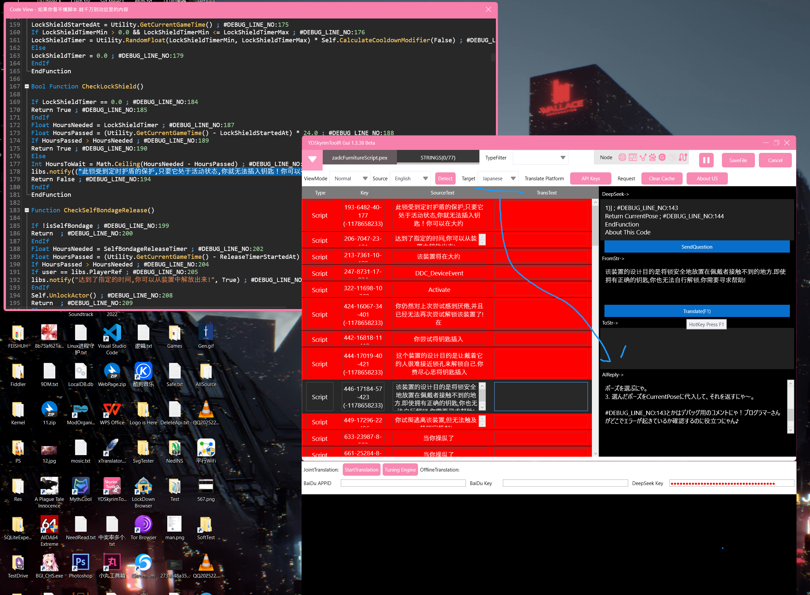
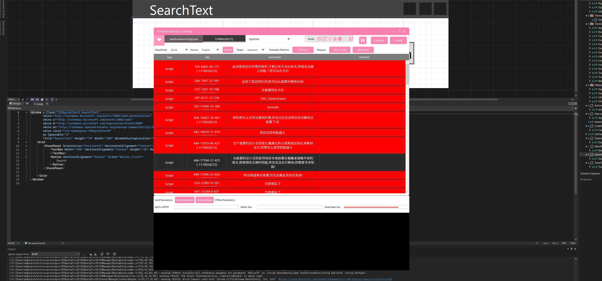
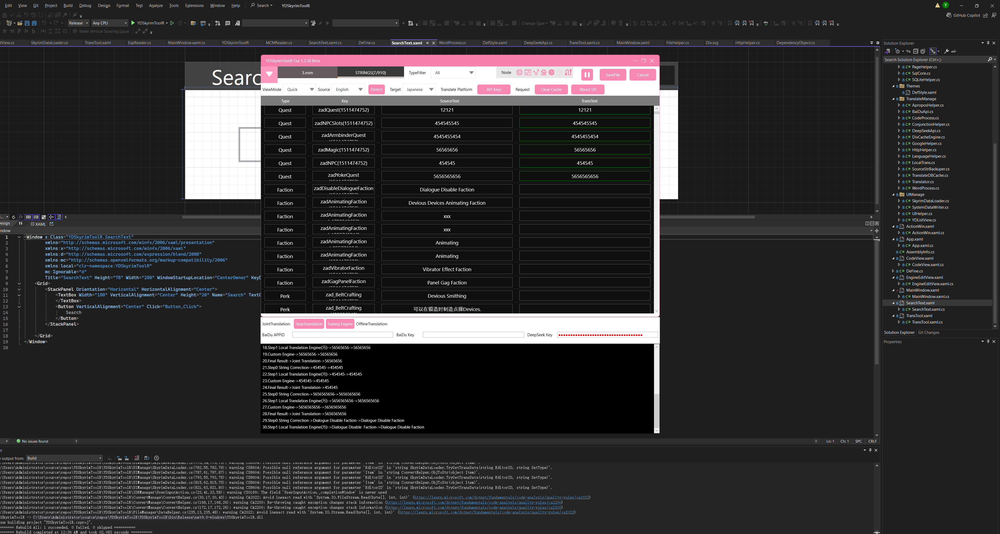
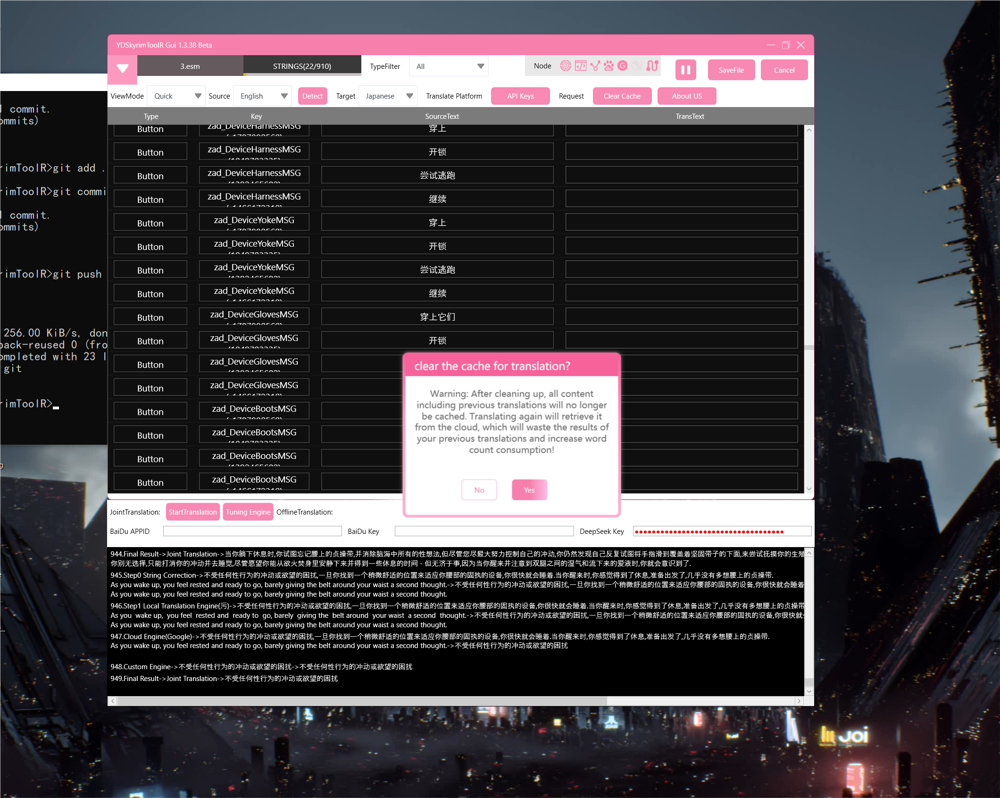
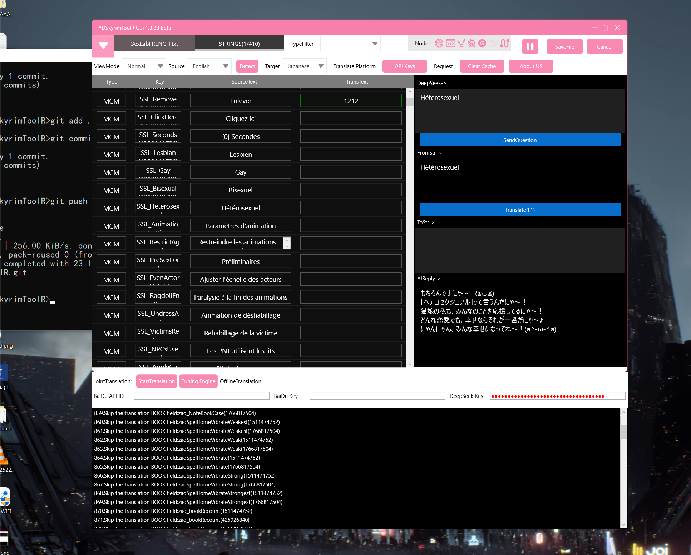

# YDSkyrimToolR
## YDSkyrimTools It is an open-source and free translation tool for Skyrim SE Mod
#### The copyright of this program belongs to [约定QQ 525084464(developer)]
#### PowerBy [9DM,泰姆瑞尔MOD组]
#### Intended to significantly reduce the workload of Sinicizers。

#### This project adopts the GPL-3.0-oly license。

#### And, some of its logic uses the following open-source frameworks/libraries：
#### (https://github.com/Mutagen-Modding/Mutagen),
#### Framework/Library Name：Mutagen.Bethesda，Developed by [Mutagen], licensed under [GPL-3.0-oly].

#### And, some of its logic uses the following open-source frameworks/libraries：
#### (https://github.com/Orvid/Champollion),
#### Framework/Library Name：Champollion，Developed by [Ovid], licensed under [GPL-3.0-oly].

#### And all components of GameFinder that have dependencies
#### (https://github.com/erri120/GameFinder)
#### Framework/Library Name：erri120.GameFinder，Developed by [erri120], licensed under [GPL-3.0-oly].

#### For more information, please refer to the [License] files of this program and the respective frameworks of the other party.

#### For any questions about the software, you can consult my QQ 52508464 or submit a post on Github

#### Currently under development, the warehouse will continue to be updated

#### Allow modification and forwarding, but please label the original source

### In addition, I also enjoy accepting donations
### If you like this project, you can support me personally through the following ways:
### 请我喝杯咖啡 -  Buy Me A Coffee

